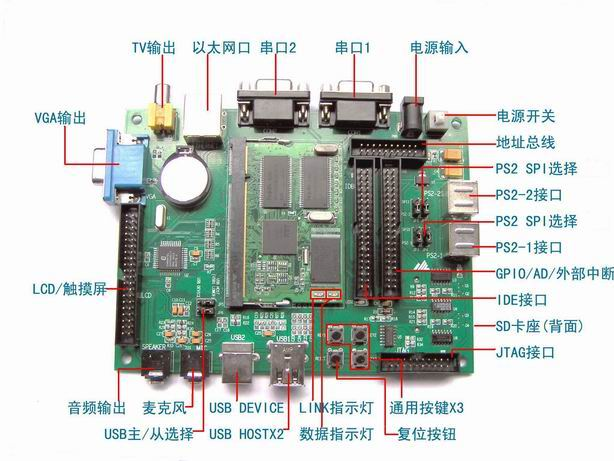

# Linux 驱动开发基础
## 驱动基本概念

### 设备
计算机最基本的三个组成部分：CPU、内存及其输入输出(I/O)设备。我们说的设备驱动中的设备就是输入输出设备。

常见的设备有：键盘、鼠标、串口、声卡、显卡、网卡、SD、flash、IDE、USB、PCI….

CPU与这些设备的接口就是输入/输出。CPU从这些设备上获取数据叫做输入，CPU将数据写入到设备上就是输出。例如对硬盘的读写。

以上的设备中键盘、鼠标是我们常见的数据设备。用来接受用户的输入。串口是一个数据传输设备，工作原理相对简单而且工作稳定。

声卡、显卡是常见的多媒体设备,主要是输出信息给用户。

网卡是我们常见的网络设备，也是计算机里非常重要的设备之一。它的作用主要用来在计算机之间的通讯。

SD卡、flash、IDE都是存储设备，具有容量较大、断电数据不丢失等特点。

USB、PCI都是总线协议驱动，他们的驱动不针对详细设备。注意：这里USB总线不包含USB设备（例如:USB鼠标驱动就是一个设备，而不是一个总线驱动）。

### 设备驱动
我们可以写个简单的驱动来访问设备。可以不在任何具有操作系统的裸机上，也可以在bootloader里。例如：串口，网卡等。
但常见的驱动运行在Linux,Windows操作系统上。我们这节课要研究的就是Linux操作系统上的驱动。

Linux操作系统的驱动与裸机（或者bootloader） 上的驱动有很多的不同。

- 要考虑与应用层的接口，例如：应用程序获取键盘输入；
- 考虑多用户，例如：几个程序都在访问串口；
- 考虑其他的协议，例如：网络协议；

等等还有很多细节区别。关于这个区别的细节后面章节将会有描述。

设备、驱动和操作系统三者之间的关系是：

* 驱动是提供操作系统访问硬件的接口，
* 设备可以通过产生中断通知操作系统有数据到来或者发送，
* 驱动是操作系统内核和硬件之间的一个中间接口和媒介。
* 内核通过驱动来最终控制硬件。
* 操作系统中的驱动和设备的关系是一一对应的；
* 应用和驱动是一对多关系；
	

	
从图中我们可以看出应用并不是直接和设备驱动进行交互，而是通过抽象层统一的系统调用接口和驱动交互。

操作系统中的驱动的任务 

* 具有一般驱动的操作功能：初始化设备，读写设备；
* 将设备的数据分配给应用；例如：网卡驱动，控制台驱动；
* 将用户数据分配给设备；例如：读写硬盘上的文件；

用户程序和操作系统，驱动程序之间是如何实现关联的？ 这就需要了解设备文件这个概念。
	
### 设备文件
Unix（Linux是类Unix系统）操作系统从一开始就将设备看作文件，通过操作文件的接口统一操作设备。
Linux上大部分设备都有对应的设备文件; 应用程序可以通过设备文件访问设备。

Linux通过设备驱动程序为应用程序提供了统一抽象的接口，从而隐藏了大量不同设备之间的区别和细节。
在Linux中对硬件设备的操作和通常的文件一样，利用标准的文件操作可以对设备上进行打开、关闭、读取或者写入操作。
系统中的每个设备由“设备特殊文件”来代表。
通过/dev访问驱动程序，/dev目录下的文件可用来访问驱动程序

	ls /dev/

#### 常用设备文件名
	
	/dev/hda	系统中的第一个IDE硬盘
	/dev/hdc	光驱
	/dev/sdb	系统中的u盘
	/dev/mmcblk	系统中的sd卡
	/dev/ttyS0	串口设备
	/dev/tty0-6 虚拟控制台
	/dev/null /dev/zero 软件设备
	/dev/random /dev/urandom	随机数字
	/dev/fb0 	LCD显示屏
	/dev/dsp 	音频声卡
	
#### 常用设备文件操作方法
* cat 命令 读设备

	从串口读取数据：  
	cat /dev/ttyS0

* 重定向符 写设备

	向串口写入数据：  
	echo data /dev/ttyS0

* dd 命令 读写设备

	将文件写入串口中  
	dd if=1.txt of=/dev/ttyS0			
	
	写入0x00到2.txt中，每次读写的数据量是512个字节，写入2次  
	dd if=/dev/zero	of=2.txt bs=512 count=2

	
[上一节](chp0-1.html)  |  [目录索引](../index.html)  |  [下一节](chp101-2.html)
