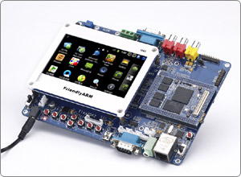
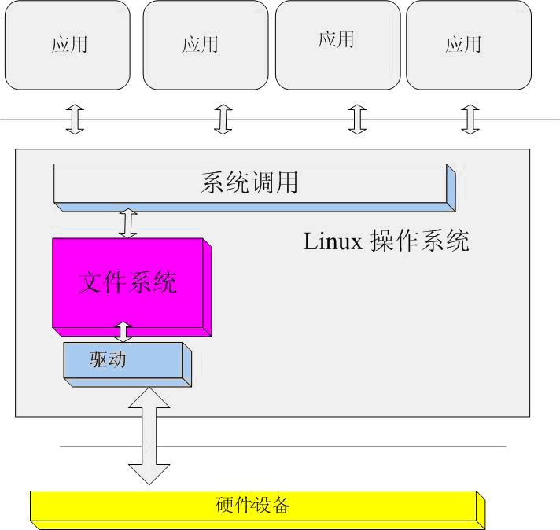

# Linux 驱动开发基础
## 驱动基本概念

本课程采用 [广州友善之臂](http://arm9.net) 的 Tiny210 开发板 作为实验开发平台。 关于这个硬件开发板的详细描述和介绍，可以参考阅读下面这个链接的内容。
[http://arm9.net/tiny210.asp](http://arm9.net/tiny210.asp)  

请通过阅读上述材料之后，回答以下有关开发板硬件平台的问题：

	1) 开发板采用的主芯片是什么型号，基于什么 ARM 内核？
	2) 开发板运行程序的主频是多少？ 使用什么内存？ 内存有多大？ 
	3) 开发板上面能够运行哪几种操作系统？ 它们有什么差别？
	4) 什么叫 BSP ，开发板的 BSP 支持哪些外设？
	
### 设备
计算机最基本的三个组成部分：CPU、内存及其输入输出(I/O)设备。我们说的设备驱动中的设备就是输入输出设备。

常见的设备有：键盘、鼠标、串口、声卡、显卡、网卡、SD、flash、IDE、USB、PCI….

CPU与这些设备的接口就是输入/输出。CPU从这些设备上获取数据叫做输入，CPU将数据写入到设备上就是输出。例如对硬盘的读写。

以上的设备中键盘、鼠标是我们常见的数据设备。用来接受用户的输入。串口是一个数据传输设备，工作原理相对简单而且工作稳定。声卡、显卡是常见的多媒体设备,主要是输出信息给用户。

网卡是我们常见的网络设备，也是计算机里非常重要的设备之一。它的作用主要用来在计算机之间的通讯。

SD卡、flash、IDE都是存储设备，具有容量较大、断电数据不丢失等特点。

USB、PCI都是总线协议驱动，他们的驱动不针对详细设备。注意：这里USB总线不包含USB设备（例如:USB鼠标驱动就是一个设备，而不是一个总线驱动）。

### 地址空间  
一般CPU都会提供一个可访问的空间来给设备使用，我们都知道32位的cpu可访问的空间是4G;也就是2的32次方；

CPU将4G的空间分配给每个被访问的设备。例如：鼠标、键盘、声卡。

在Linux上，我们可以通过下面的命令查看地址空间的分配。

	bash # cat /proc/iomem

一般设备地址的空间分配都是由硬件连线决定的。ARM、MIPS等都是使用这种访问方式。

IO空间

在i386 体系结构里，除了以上所有的地址空间外，还有一段64k的IO空间。就是我们通常说的端口或者寄存器。

	可以通过下面的命令看到。
	bash # cat /proc/ioports

### 设备驱动
上面我们已经讲过计算机的运行中就是CPU从一个设备中取数据，经过加工后放到另一个设备。那么这过程中CPU多次访问了设备，CPU访问设备的方法就是inb,outb等组合。这些组合就是驱动。

有些设备的访问使用一条outb/inb语句就可以完成。例如：GPIO。但大部分设备需要多条outb/inb组合才能访问设备。这种组合是根据不同的设备来决定组合的逻辑。例如：IDE硬盘，需要使用复杂的索引访问模式。

我们可以写个简单的驱动来访问设备。可以不在任何具有操作系统的裸机上，也可以在bootloader里。例如：串口，网卡等。但常见的驱动运行在Linux,Windows操作系统上。

我们这节课要研究的就是Linux操作系统上的驱动。
Linux操作系统的驱动与裸机（或者bootloader） 上的驱动有很多的不同。要考虑与应用层的接口，例如：应用程序获取键盘输入；
	
		考虑多用户，例如：几个程序都在访问串口；
		考虑其他的协议，例如：网络协议；
	
	等等还有很多细节区别。关于这个区别的细节后面章节将会有描述。

设备、驱动和操作系统三者之间的关系是：
	驱动是提供操作系统访问硬件的接口，设备可以通过产生中断通知操作系统有数据到来或者发送，驱动是操作系统内核和硬件之间的一个中间接口和媒介。
	内核通过驱动来最终控制硬件。

	
### 设备文件
Unix（Linux是类Unix系统）操作系统从一开始就将设备看作文件，通过操作文件的接口统一操作设备。
Linux上大部分设备都有对应的设备文件;应用程序可以通过设备文件访问设备。详细介绍见设备文件章节。
	
设备驱动的作用

在《设备驱动的概念》里我们知道了驱动是CPU访问设备的方法。大部分驱动是在操作系统里实现的。那么操作里的驱动有什么作用呢？管理所有设备，给系统和用户程序提供访问接口。

关系图如下：
	操作系统中的驱动和设备的关系是一一对应的；
	应用和驱动是一对多关系；

操作系统中的驱动的任务 
	具有一般驱动的操作功能：初始化设备，读写设备；
	将设备的数据分配给应用；例如：网卡驱动，控制台驱动；
	将用户数据分配给设备；例如：读写硬盘上的文件；

统一抽象接口---应用

	
从图中我们可以看出应用并不是直接和设备驱动进行交互，而是通过抽象层统一的系统调用接口和驱动交互。

Linux通过设备驱动程序为应用程序提供了统一抽象的接口，从而隐藏了大量不同设备之间的区别和细节，在Linux中对硬件设备的操作和通常的文件一样，利用标准的文件操作可以对设备上进行打开、关闭、读取或者写入操作。系统中的每个设备由“设备特殊文件”来代表。例如，/dev/hda代表系统中的第一个IDE硬盘，每个由相同的设备驱动程序控制的设备具有相同的主设备号，而次设备号则用来区分同类设备中的不同设备，设备特殊文件的虚拟文件系统（Virtual FileSystem，简称VFS）索引节点中包含设备号信息，如果通过系统调用访问设备，则内核通过该VFS索引节点汇总的设备号信息调用适当的设备驱动程序。

[上一节](chp0-1.html)  |  [目录索引](../index.html)  |  [下一节](chp101-2.html)
